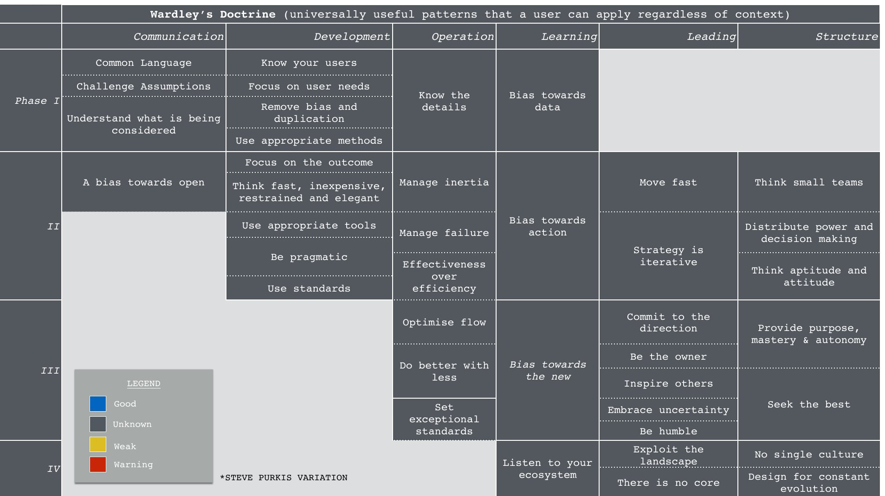

<!--
size: 4:3
theme: default
-->

## Create strategies using Wardley Maps

---
<!-- paginate: true -->

## What will you learn?

- How to draw your first map
- How to use the map to make strategic decisions
- How to include your team to this process

---

## All the steps in one page
1. Write a customer, a need, and dependencies
1. Draw a map
1. Move the dependencies
1. Add trends to the map
1. Add moves to the map
1. Add strategic moves
1. Decide on actions

---

## 1. Write down a customer, need, and dependency

Steps:
1. write down name of a customer.
1. Write one need of this customer.
1. Write a few things that are needed to meet this need.

Example:
1. User: software engineer.
1. Need: build a web site.
1. Dependencies: choose a technology, learn how to use it, build a web site, test it, deploy it, maintain it.

---

## 2. Draw a map

TODO: add drawing

---

## 3. Move the dependencies on the evolution scale

TODO: add drawing

---

Evolution ([text format](evolution.html))

---

## 4. Add climatic patters to the map

TODO: add drawing

---

Climatic Patterns ([text format](climatic-patterns.html))

---

## 5. Add doctrine to the map

TODO: add drawing

---

Doctrine ([text format](doctrine.html))

---

## 6. Add strategic move

TODO: add drawing

---

Gameplay ([text format](gameplay.html))

---

## 7. Take actions

---

## Invite your team

---

## Here is the cycle you went through:

---

## Repeat the cycle

Repeat this strategy cycle with the team every few weeks.

---

## Next Steps (optional)

- [Become a Strategy Coach in 5 Minutes](coach/) (5 min video)

