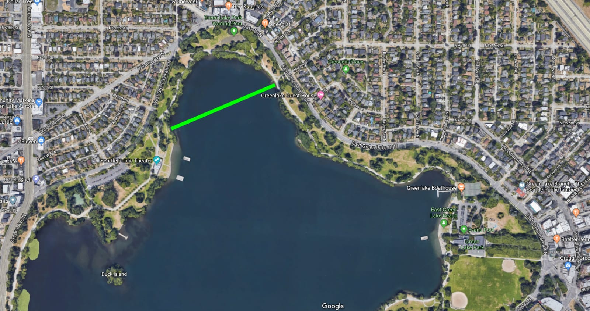

# Swim

## Open Water Swimming Locations in Seattle

#### Green Lake
* [Location](https://www.google.com/maps/place/Green+Lake,+Seattle,+WA/@47.6778049,-122.3422588,15z/data=!3m1!4b1!4m5!3m4!1s0x54901414dad562fd:0xc942aafc8f01267c!8m2!3d47.6798338!4d-122.3257826)
* Restrooms
* Lifeguard Hours at the east side: May 25 - June 21, 2pm - 7pm weekdays, 11am - 7pm weekends. June 22 - August 25, 12pm - 7pm weekdays, 11am - 7pm weekends
* Lifeguard Hours at the west side: June 22 - September 2 12pm - 7pm weekdays, 11am - 7pm weekends

### Lake Washington Locations

#### Juanita Beach
* [9703 NE Juanita Dr, Kirkland, WA 98034](https://www.google.com/maps/place/Juanita+Beach+Park/@47.7048015,-122.215372,15z/data=!4m2!3m1!1s0x0:0xdb0cac503530060c?sa=X&ved=2ahUKEwjc3Kn-0KXpAhXZHDQIHZK_A8MQ_BIwD3oECBMQCw)
* [Site](https://www.theswimguide.org/beach/6506)

#### waverly Beach
* [633 Waverly Park Way, Kirkland, WA 98033](https://www.google.com/maps/place/Waverly+Beach+Park/@47.6869314,-122.2166368,15z/data=!4m2!3m1!1s0x0:0x9c268a055fc8afec?sa=X&ved=2ahUKEwjgx82s0aXpAhVSKH0KHShLB5kQ_BIwEHoECBEQCw)
* [Site](https://www.theswimguide.org/beach/6522)

#### Matthews Beach
* [Location](https://www.google.com/maps/place/Matthews+Beach,+Seattle,+WA/@47.7037068,-122.2964961,14z/data=!3m1!4b1!4m5!3m4!1s0x549013c4f0769c2d:0x8c1371438367252f!8m2!3d47.6958965!4d-122.2762179)
* Restrooms
* Lifeguard Hours: June 22 - September 2, 12pm - 7pm weekdays, 11am - 7pm weekends

#### Magnuson Park
* [Location](https://www.google.com/maps/search/magnuson+park/@47.6825264,-122.2617557,16z)
* Restrooms
* Lifeguard Hours: June 22 - August 25 12pm - 7pm weekdays, 11am - 7pm weekends

#### Madison Park
* [Location](https://www.google.com/maps/place/Madison+Park,+Seattle,+WA+98112/@47.637403,-122.295785,14.5z/data=!4m5!3m4!1s0x549014c9b0611b3b:0xf85be8f3df2273b8!8m2!3d47.6346093!4d-122.2796452)
* Restrooms
* Lifeguard Hours June 22 - September 2, 12pm - 7pm weekdays, 11am - 7pm weekends

#### Denny Blaine
* [Location](https://www.google.com/maps/place/Harrison%2FDenny-Blaine,+Seattle,+WA/@47.6256799,-122.2945973,15.5z/data=!4m5!3m4!1s0x54906b320919862f:0x64b603b3eca2ac01!8m2!3d47.6214746!4d-122.2864809)
* No Restrooms
* Nude beach

#### Madrona Park
* [Location](https://www.google.com/maps/place/Madrona+Park/@47.6119266,-122.2913852,14.5z/data=!4m5!3m4!1s0x54906b21023999a5:0x48641e387b39e571!8m2!3d47.6102275!4d-122.2834342)
* Lifeguard Hours: May 25 - June 21, 2pm - 7pm weekdays, 11am - 7pm weekends. June 22 - August 25 12pm - 7pm weekdays, 11am - 7pm weekends

#### Mount Baker Park Beach
* [Location](https://www.google.com/maps/place/2521+Lake+Park+Dr+S,+Seattle,+WA+98144/@47.5825647,-122.2957019,15.75z/data=!4m5!3m4!1s0x54906a5f75947c1d:0x1a5233db0133ed42!8m2!3d47.583083!4d-122.2874235)
* [Website](https://www.seattle.gov/parks/find/parks/mount-baker-park)
* Lifeguard Hours: Jun 22 - Sep 2, 12pm - 7pm weekdays, 11am - 7pm weekends

#### Seward Park
* [Location](https://www.google.com/maps/place/Seward+Park,+Seattle,+WA+98118/@47.5517196,-122.2803942,14z/data=!3m1!4b1!4m5!3m4!1s0x54906a1c63b3aa63:0x44e4a05de3025c2b!8m2!3d47.5502603!4d-122.26485)
* Restrooms
* Lifeguard Hours: June 22 - September 2, 12pm - 7pm weekdays, 11am - 7pm weekends

#### Pritchard Island Beach
* [Location](https://www.google.com/maps/place/Pritchard+Island+Beach/@47.5283517,-122.2864542,14z/data=!4m5!3m4!1s0x0:0xac0f7ca82eb3fde0!8m2!3d47.5286558!4d-122.2628937)
* Lifeguard Hours: June 22 - August 25, 12pm - 7pm weekdays, 11am - 7pm weekends

### Puget Sonud Locations

#### Golden Gardens
* [Location](https://www.google.com/maps/place/Golden+Gardens+Park/@47.6905458,-122.4026619,15z/data=!4m5!3m4!1s0x549016648e6062ef:0x5b2c838d4c7f0aca!8m2!3d47.6917517!4d-122.4030912)
* [Website](https://www.seattle.gov/parks/find/parks/golden-gardens-park)
* Lifeguard Hours:

#### Alki
* [Location](https://www.google.com/maps/place/Alki+Beach/@47.58221,-122.4122072,14.25z/data=!4m5!3m4!1s0x54904079efcab4e7:0x5e9c1b1142e9d6e5!8m2!3d47.5859155!4d-122.4014255)
* [Website](https://www.seattle.gov/parks/find/parks/alki-beach-park)
* Lifeguard Hours:

## Sammamish
* https://www.yelp.com/search?find_desc=swimming+lakes&find_loc=Sammamish%2C+WA

## Other links
* https://www.outdoorproject.com/travel/washingtons-50-best-swimming-holes
