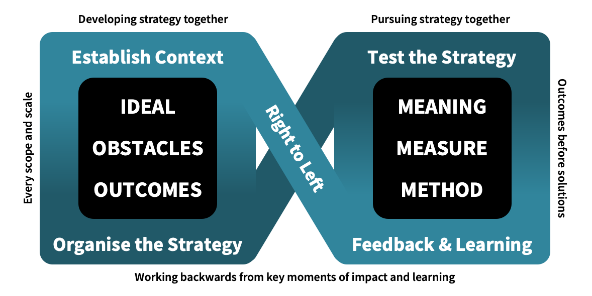

# Build teams in 1 minute

## Book cover
• Title "Build teams in 1 minute".
• Sub title: "A visual hands-on guide for building teams"
• Image of challenge in a shape of a lightning. One person on the left, group of people on the right.
• Simple drawing: an airplane. Top down view.
• Text at the bottom: Oren Golan.

## Learning Outcomes page
• Module 1 - be able to categorize a challenge using Cynefin Framework.
• Module 2 - be able to document, build, and operate a strategy.

## Core concepts page
* Visual of IdOO.
* Visual of Agendashift Model (outcome-oriented and wholehearted engagement model).
* Visual of Cynefin Framework.

## Chapter 1: Identify complex and complicated challenges.

## Chapter 2: Build teams that fit each challenge.

## Back of book
Same as Core concepts page
